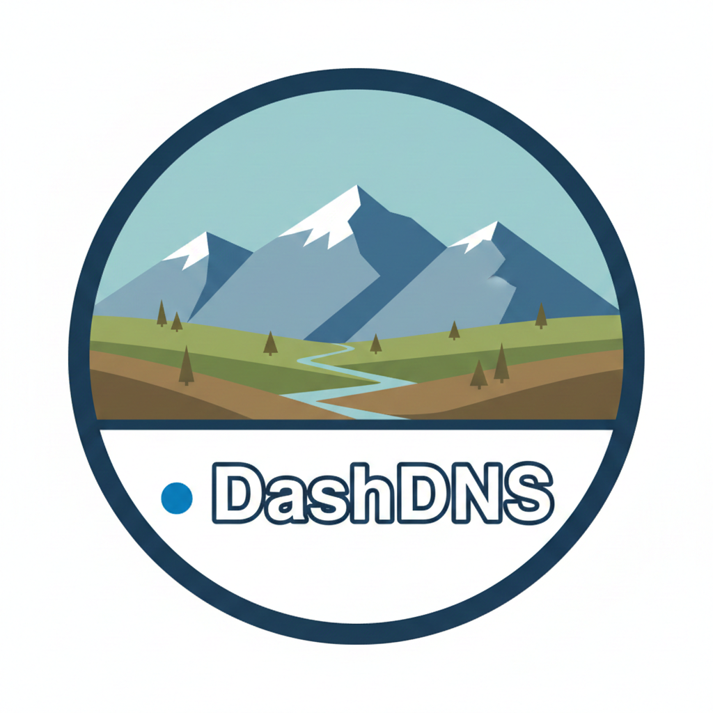

# DashDNS (Kubernetes)

</img>

Multi-tenant Kubernetes clusters get messy fast. DNS traffic gets even messier faster.
This project provides a policy-driven DNS sidecar injection system for Kubernetes: a controller + mutating admission webhook injects a DNS proxy sidecar into selected pods so you can enforce allow/block rules, apply per-tenant policies, and gain visibility into DNS usage without reworking every app.

## Why This Exists

Kubernetes DNS is shared infrastructure. In multi-tenant environments, that usually means:

- "Who queried what?" is basically a guessing game
- One tenant's "creative" DNS usage becomes everyone's incident
- Security teams want guardrails, platform teams want control, app teams want zero changes

So we inject policy at the pod level.

## What You Get

**Policy-based injection:** Select pods via labels, inject DNS sidecar automatically.

**Multi-tenancy friendly:**
- Policies scoped by namespace/tenant labels (depending on your design)
- Per-tenant allow/block lists
- Safe defaults and guardrails

**Visibility:**
- DNS query logs (who/what/when, depending on how you emit)
- Prometheus metrics (queries allowed/blocked, latency, upstream failures, cache hit ratio, etc.)

**No app changes:** Apps keep using cluster DNS as usual; sidecar intercepts at the pod network level.

**GitOps compatible:** CRDs + controller reconcile loop, easy to manage via YAML.

## Architecture

High-level flow:

1. You define a DNS policy (CRD) that includes a `targetSelector` and rules (allow/block)
2. The mutating webhook intercepts pod CREATE/UPDATE
3. If the pod matches, it injects:
   - DNS proxy sidecar container
   - Required initContainer / iptables rules (if you do interception this way)
   - Environment variables / annotations for policy binding
4. The controller reconciles policy objects and serves policy config (or pushes config), depending on your approach
5. Sidecar enforces rules and emits metrics/logs

```mermaid
flowchart LR
    A[kubectl apply<br/>Deployment]
        -->|Admission| 
    B[Mutating Webhook<br/>- matches pod labels<br/>- inject sidecar]

    B --> C[Pod w/ DNS Sidecar<br/>- intercept DNS<br/>- allow/block<br/>- metrics/logs]

    C --> D[Controller<br/>- CRD reconciliation<br/>- policy API/config]
```

## Repositories in This Organization

This organization contains the building blocks:

- **Controller:** Reconciles DNSPolicy CRDs, handles config distribution and lifecycle
- **Webhook:** Mutating admission webhook that injects DNS sidecar based on selectors
- **Sidecar / DNS proxy:** Enforces policy and exports metrics/logs

Replace the placeholders below with actual repo names:

- `dns-sidecar-injector-controller`
- `dns-sidecar-injector-webhook`
- `dns-sidecar-injector-sidecar`

## Custom Resource (Example)

Example DNSPolicy object (shape may differ in your implementation):

```yaml
apiVersion: dns.dnspolicies.io/v1alpha1
kind: DnsPolicy
metadata:
  name: tenant-a-restrict-dns
  namespace: tenant-a
spec:
  targetSelector:
    app: frontend
    env: production
  allowList:
    - "*.example.com"
    - "*.googleapis.com"
    - "api.trusted-service.io"
  blockList:
    - "*.malicious-site.com"
    - "tracking.ads.net"
```

## Installation (Concept)

Keep this section short until you publish real manifests/Helm charts.

Typical install components:

- CRDs
- Controller deployment + RBAC
- Webhook deployment + service + MutatingWebhookConfiguration
- Certificates (cert-manager recommended)
- Sidecar image registry access

Planned delivery options:

- Helm chart (recommended)
- Kustomize overlays
- Raw manifests for minimal clusters

## Multi-Tenancy Model

This project is designed with multi-tenant clusters in mind:

**Policy scoping:** Namespace-scoped policies by default (one tenant = one namespace), or cluster-scoped with explicit tenant selectors.

**Isolation:** One tenant's policy should not affect another tenant's pods.

**Safe operations:**
- Explicit opt-in selectors
- Fail-open vs fail-closed modes (configurable)
- Audit-friendly logs and metrics

If you run a shared platform cluster, this is the part you actually care about.

## Observability

Typical metrics you'll want (exported by sidecar and/or controller):

- `dns_requests_total{result="allowed|blocked|error", tenant="", namespace="", pod=""}`
- `dns_request_duration_seconds_bucket{...}`
- `dns_upstream_errors_total{...}`
- `dns_cache_hits_total{...}` (if caching exists)

**Logs:**
- Structured query logs with policy decision (allowed/blocked)
- Optional sampling to avoid cost explosions

## Security Notes

- Webhook requires proper TLS setup
- RBAC should be minimal:
  - Read pods/labels
  - Manage CRDs
  - Optionally create/update webhook configs (usually installed once, not reconciled)
- Sidecar interception via iptables needs care and should be explicitly documented

## Roadmap

- [ ] Helm chart + example values
- [ ] Policy conflict resolution / precedence rules
- [ ] Per-tenant rate limiting (optional)
- [ ] Dry-run / audit-only mode
- [ ] Grafana dashboard JSON
- [ ] E2E tests (kind + cert-manager + webhook)
- [ ] Docs site (mkdocs/material) or GitHub Pages

## Contributing

PRs welcome. Issues even more welcome.

Guidelines:
- Use GitHub issues for feature requests and bugs
- Prefer small, focused PRs
- Include tests where it makes sense
- Provide clear reproduction steps and logs when reporting issues

## License

Choose something OSS-friendly:

- **Apache-2.0** if you want "enterprise friendly"
- **MIT** if you want maximum permissiveness

