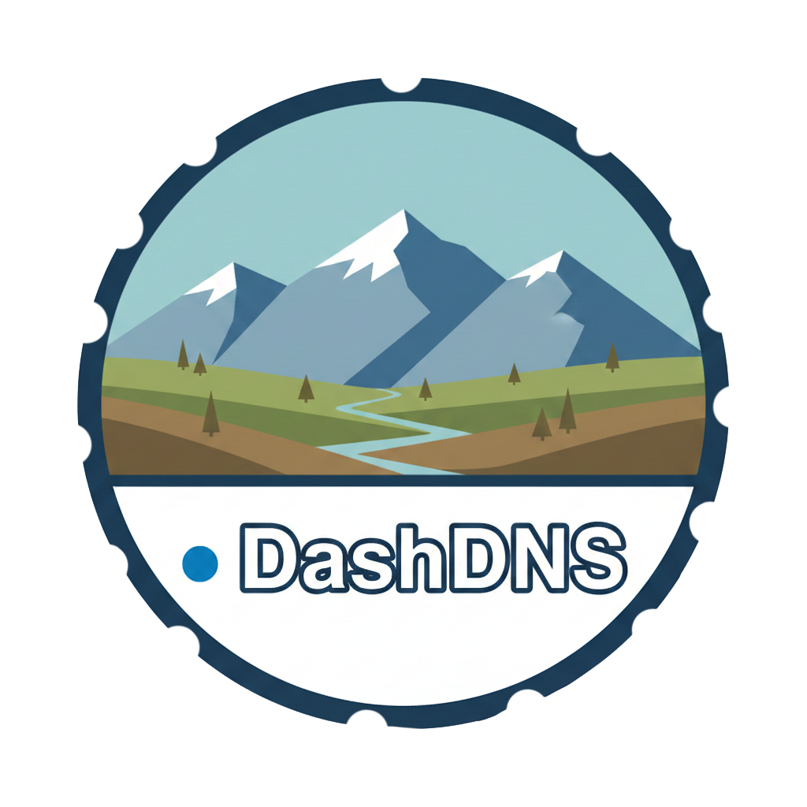
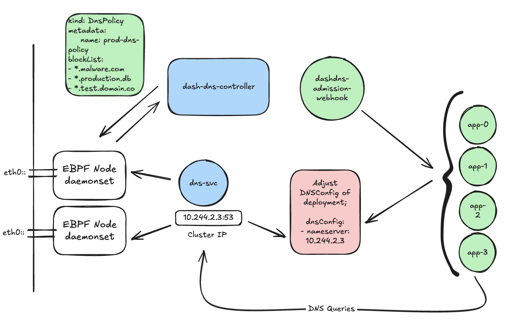
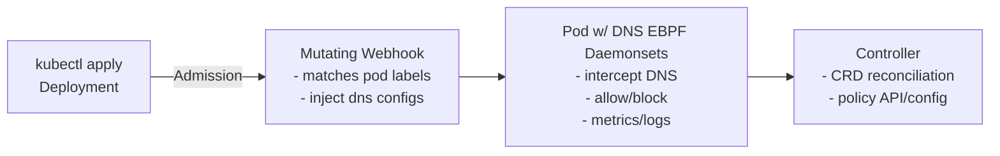

# DashDNS (Kubernetes)

</img>

Multi-tenant Kubernetes clusters get messy fast. DNS traffic gets even messier faster.
This project provides a policy-compatible and EBPF DNS proxy for Kubernetes: a controller + mutating admission webhook injects a DNS configurations into selected pods so you can enforce allow/block rules, apply per-tenant policies, and gain visibility into DNS usage without reworking every app.

## Why This Exists

Kubernetes DNS is shared infrastructure. In multi-tenant environments, that usually means:

- "Who queried what?" is basically a guessing game
- One tenant's "creative" DNS usage becomes everyone's incident
- Security teams want guardrails, platform teams want control, app teams want zero changes

So we inject policy at the pod level.

## What You Get

**Policy-based injection:** Select pods via labels, inject DNS configs automatically.

**Multi-tenancy friendly:**
- Policies scoped by namespace/tenant labels (depending on your design)
- Per-tenant allow/block lists
- Safe defaults and guardrails

**Visibility:**
- DNS query logs (who/what/when, depending on how you emit)
- Prometheus metrics (queries allowed/blocked, latency, upstream failures, cache hit ratio, etc.)

**No app changes:** Apps keep using cluster DNS as usual; sidecar intercepts at the pod network level.

**GitOps compatible:** CRDs + controller reconcile loop, easy to manage via YAML.

## Architecture

</img>

High-level flow:

1. You define a DNS policy (CRD) that includes a `targetSelector` and rules (allow/block)
2. The mutating webhook intercepts pod CREATE/UPDATE
3. If the pod matches, it injects:
   - DNS proxy ebpf based daemonsets
   - Required initContainer / iptables rules (if you do interception this way)
   - Environment variables / annotations for policy binding
4. The controller reconciles policy objects and serves policy config (or pushes config), depending on your approach

```mermaid

flowchart LR
    A[kubectl apply<br/>Deployment]
    B[Mutating Webhook<br/>- matches pod labels<br/>- inject dns configs]
    C[Pod w/ DNS EBPF Daemonsets<br/>- intercept DNS<br/>- allow/block<br/>- metrics/logs]
    D[Controller<br/>- CRD reconciliation<br/>- policy API/config]

    A -->|Admission| B
    B --> C
    C --> D

```

## Repositories in This Organization

This organization contains the building blocks:

- **Controller:** Reconciles DNSPolicy CRDs, handles config distribution and lifecycle
- **Webhook:** Mutating admission webhook that injects DNS sidecar based on selectors

**Logs:**
- Structured query logs with policy decision (allowed/blocked)
- Optional sampling to avoid cost explosions

## Security Notes

- Webhook requires proper TLS setup
- RBAC should be minimal:
  - Read pods/labels
  - Manage CRDs
  - Optionally create/update webhook configs (usually installed once, not reconciled)
- Sidecar interception via iptables needs care and should be explicitly documented

## Roadmap

- [x] Helm chart + example values
- [x] Policy conflict resolution / precedence rules
- [x] Per-tenant rate limiting (optional)
- [x] Dry-run / audit-only mode
- [x] Grafana dashboard JSON
- [ ] E2E tests (kind + cert-manager + webhook)
- [x] Docs site (mkdocs/material) or GitHub Pages

## Contributing

PRs welcome. Issues even more welcome.

Guidelines:
- Use GitHub issues for feature requests and bugs
- Prefer small, focused PRs
- Include tests where it makes sense
- Provide clear reproduction steps and logs when reporting issues

## License

- **Apache-2.0**
